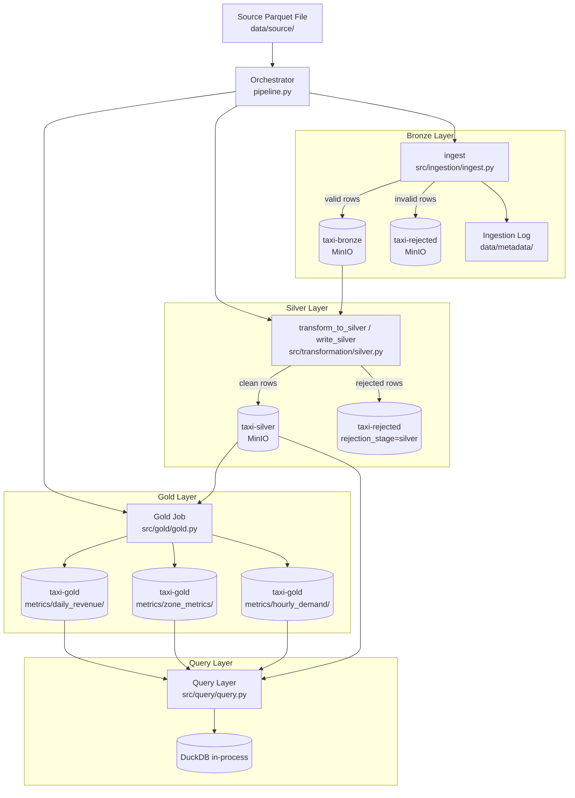

# Design Document — AWS Data Pipeline Completion

## Overview

This document describes the technical design for completing the NYC Yellow Taxi data engineering pipeline. The Bronze ingestion layer (`src/ingestion/`) and Silver transformation layer (`src/transformation/silver.py`) are already implemented and production-ready. The remaining work covers four new modules, comprehensive test coverage, and documentation.

**What is being built:**

| Module | Path | Description |
|---|---|---|
| Gold Aggregation Job | `src/gold/gold.py` | PySpark job that reads Silver data and writes three aggregation tables to MinIO |
| Query Layer | `src/query/query.py` | DuckDB-based module for running SQL against Silver/Gold Parquet files on MinIO |
| Orchestrator | `pipeline.py` | Single CLI entrypoint that drives Bronze → Silver → Gold in sequence |
| Tests | `tests/unit/`, `tests/integration/` | Full unit and integration test coverage for all modules |
| README | `README.md` | Complete setup and architecture documentation |

The storage backend is MinIO, a Docker-based S3-compatible object store. PySpark accesses MinIO via the S3A connector using `hadoop-aws`. DuckDB accesses MinIO via its `httpfs` extension using the S3 endpoint.

---

## Architecture



### Key Design Decisions

**PySpark for Gold (not pandas):** The Silver layer already uses PySpark and the SparkSession must be shared across Silver and Gold to satisfy Requirement 5.7. Using PySpark for Gold is a natural fit and avoids pulling a large Silver partition into memory as a pandas DataFrame.

**DuckDB for Query Layer:** DuckDB's `httpfs` extension provides direct S3-compatible reads from MinIO without an extra server process, matching the intent of Requirement 4. It returns results as native pandas DataFrames, which is the required return type.

**`pipeline.py` at project root:** The orchestrator is a standalone script, not a module inside `src/`, so it can be invoked as `python pipeline.py --source-file ...` without `python -m` indirection. It imports `ingest`, `transform_to_silver`, `write_silver`, and the Gold Job functions.

**Dynamic partition overwrite:** Zone metrics (Requirement 2.3) and hourly demand (Requirement 3.2) use Spark's dynamic partition overwrite mode (`spark.sql.sources.partitionOverwriteMode=dynamic`). This replaces only the `pickup_date` partitions present in the current Silver input, preserving older historical partitions. Daily revenue (Requirement 1.3) uses regular `overwrite` mode since each full job run is expected to regenerate all partitions.

---

## Components and Interfaces

### Gold Job — `src/gold/gold.py`

```python
def read_silver(spark: SparkSession, silver_path: str) -> DataFrame
def compute_daily_revenue(df: DataFrame) -> DataFrame
def compute_zone_metrics(df: DataFrame) -> DataFrame
def compute_hourly_demand(df: DataFrame) -> DataFrame
def write_gold(df: DataFrame, output_path: str, mode: str = "overwrite") -> None
def run_gold_job(spark: SparkSession) -> None
```

- `read_silver` reads all Silver Parquet from `s3a://taxi-silver/taxi/` and returns a Spark DataFrame.
- The three `compute_*` functions are **pure transformations** — they accept a DataFrame and return a new DataFrame. No I/O. This is the key design decision that makes them unit-testable without MinIO.
- `write_gold` writes a DataFrame to the specified Gold path.
- `run_gold_job` is the high-level entrypoint used by the Orchestrator and the `if __name__ == "__main__"` block.

### Query Layer — `src/query/query.py`

```python
class QueryLayer:
    def __init__(self) -> None
    def query(self, sql: str, dataset: str, params: dict | None = None) -> pd.DataFrame
    def _build_path(self, dataset: str) -> str
    def _configure_s3(self, conn: duckdb.DuckDBPyConnection) -> None
```

- `__init__` reads `MINIO_ENDPOINT`, `MINIO_ACCESS_KEY`, `MINIO_SECRET_KEY` from environment via `config.py`. Raises `ValueError` immediately if any are absent or empty — no deferred failure.
- `query` accepts a SQL string (1–10,000 chars) and a `dataset` identifier (`"silver"`, `"gold/daily_revenue"`, etc.), constructs the S3 path, and executes the query through DuckDB's `httpfs` extension.
- Parameterized values are bound via DuckDB's `?` placeholder mechanism — they are never interpolated into the SQL string directly.
- Returns a `pd.DataFrame`. Column names and dtypes are exactly those of the underlying Parquet schema (DuckDB preserves schema fidelity).

### Orchestrator — `pipeline.py`

```python
def parse_args() -> argparse.Namespace
def run_pipeline(source_file: str) -> int   # returns exit code
def main() -> None
```

- `parse_args` defines `--source-file` as a required positional argument. `argparse` handles the missing-argument case automatically (non-zero exit).
- `run_pipeline` creates a single SparkSession, then calls `ingest()` → `transform_to_silver()` + `write_silver()` → `run_gold_job()` in sequence. Each step is wrapped in a `try/except`. On failure, the function logs the error and returns a non-zero exit code. On success it logs the summary line.
- The SparkSession is passed into `run_gold_job` so no second session is created.
- Row counts for the summary line come from the `quality_report` dict returned by `run_quality_checks()` inside `ingest()`. The orchestrator exposes these up the call stack.

---

## Data Models

### Silver Schema (input to Gold)

The Silver layer writes the following columns to `s3a://taxi-silver/taxi/` partitioned by `pickup_date`:

| Column | Type | Notes |
|---|---|---|
| `vendor_id` | long | Renamed from `VendorID` |
| `tpep_pickup_datetime` | timestamp | Raw pickup time |
| `tpep_dropoff_datetime` | timestamp | Raw dropoff time |
| `passenger_count` | double | Nullable |
| `trip_distance` | double | |
| `ratecode_id` | double | Renamed from `RatecodeID` |
| `store_and_fwd_flag` | string | |
| `pickup_location_id` | long | Renamed from `PULocationID` |
| `dropoff_location_id` | long | Renamed from `DOLocationID` |
| `payment_type` | long | |
| `fare_amount` | double | |
| `extra` | double | |
| `mta_tax` | double | |
| `tip_amount` | double | |
| `tolls_amount` | double | |
| `improvement_surcharge` | double | |
| `total_amount` | double | |
| `congestion_surcharge` | double | |
| `airport_fee` | double | Renamed from `Airport_fee` |
| `cbd_congestion_fee` | double | |
| `trip_duration_minutes` | double | Derived: `(dropoff - pickup) / 60` |
| `pickup_date` | date | Partition key, derived from `tpep_pickup_datetime` |
| `pickup_hour` | integer | Derived: `hour(tpep_pickup_datetime)` |

### Gold Daily Revenue Schema

Written to `s3a://taxi-gold/metrics/daily_revenue/`, partitioned by `pickup_date`:

| Column | Type | Notes |
|---|---|---|
| `pickup_date` | date | Partition key |
| `total_trip_count` | long | `count(*)` — counts all rows |
| `total_fare_amount` | double | `sum(fare_amount)` — ignores nulls |
| `total_tip_amount` | double | `sum(tip_amount)` — ignores nulls |
| `total_amount` | double | `sum(total_amount)` — ignores nulls |
| `avg_fare_amount` | double | `avg(fare_amount)` — ignores nulls |

### Gold Zone Metrics Schema

Written to `s3a://taxi-gold/metrics/zone_metrics/`, partitioned by `pickup_date`:

| Column | Type | Notes |
|---|---|---|
| `pickup_date` | date | Partition key |
| `pickup_location_id` | long | Group key |
| `trip_count` | long | `count(*)` |
| `avg_fare_amount` | double | `avg(fare_amount)` |
| `avg_trip_distance` | double | `avg(trip_distance)` |
| `avg_trip_duration_minutes` | double | `avg(trip_duration_minutes)` |

### Gold Hourly Demand Schema

Written to `s3a://taxi-gold/metrics/hourly_demand/`, partitioned by `pickup_date`:

| Column | Type | Notes |
|---|---|---|
| `pickup_date` | date | Partition key |
| `pickup_hour` | integer | Group key, range [0, 23] |
| `trip_count` | long | `count(*)` |
| `avg_fare_amount` | double | `avg(fare_amount)` |

### Ingestion Log Schema

Local file at `data/metadata/ingestion_log.parquet`:

| Column | Type | Notes |
|---|---|---|
| `source_file` | string | Base filename |
| `source_path` | string | Full local path |
| `file_size_in_bytes` | int64 | |
| `ingestion_timestamp` | string | ISO-8601 UTC |
| `target_bucket` | string | |
| `target_key` | string | S3 object key |
| `status` | string | `"SUCCESS"` or `"FAILED"` |

---

## Correctness Properties

*A property is a characteristic or behavior that should hold true across all valid executions of a system — essentially, a formal statement about what the system should do. Properties serve as the bridge between human-readable specifications and machine-verifiable correctness guarantees.*

### Property 1: Daily Revenue Row-Count Invariant

*For any* Silver DataFrame where every row has a non-null `pickup_date`, the sum of `total_trip_count` across all rows of the daily revenue output shall equal the total row count of the Silver input DataFrame.

**Validates: Requirements 1.6**

---

### Property 2: Zone Metrics Row-Count Invariant

*For any* Silver DataFrame where every row has a non-null `pickup_date` and a non-null `pickup_location_id`, the sum of `trip_count` across all rows of the zone metrics output shall equal the total row count of the Silver input DataFrame.

**Validates: Requirements 2.4**

---

### Property 3: Hourly Demand Row-Count Invariant with Filter

*For any* Silver DataFrame, the sum of `trip_count` across all rows of the hourly demand output shall equal the count of rows in the input where `pickup_hour` is non-null and within [0, 23]. Rows with out-of-range or null `pickup_hour` shall not appear in the output.

**Validates: Requirements 3.4, 3.5**

---

### Property 4: Query Layer Returns Schema-Faithful DataFrames

*For any* Parquet file written to MinIO with a known schema, executing a `SELECT *` query through the Query Layer shall return a pandas DataFrame whose column names and column dtypes are identical to those of the Parquet file's schema — no columns added, removed, or recast.

**Validates: Requirements 4.5**

---

### Property 5: Query Layer Determinism

*For any* valid SQL string and dataset identifier, executing the same query twice in sequence against an unchanged MinIO path shall return DataFrames with identical row counts and identical column values in every row.

**Validates: Requirements 4.6**

---

### Property 6: Missing Environment Variable Raises ValueError

*For each* required environment variable (`MINIO_ENDPOINT`, `MINIO_ACCESS_KEY`, `MINIO_SECRET_KEY`), when that variable is absent or empty at initialization time, constructing a `QueryLayer` shall raise a `ValueError` whose message contains the name of the missing variable. No connection attempt shall be made.

**Validates: Requirements 4.7**

---

### Property 7: Orchestrator Rejection Rate Computation

*For any* non-negative integers `total`, `valid`, and `rejected` where `valid + rejected = total`, the summary line produced by the Orchestrator shall report `rejection_rate = round((rejected / total) * 100, 2)`, and when `total = 0`, the reported rate shall be `0.00%`.

**Validates: Requirements 5.6**

---

### Property 8: Quarantine Row-Count Invariant

*For any* DataFrame with at least one row, calling `add_validation_errors()` shall return a DataFrame with the same number of rows as the input — no rows are dropped or added.

**Validates: Requirements 7.5**

---

### Property 9: Silver Transformation Row-Count Invariant

*For any* input Spark DataFrame containing one or more rows, `transform_to_silver()` shall produce `silver_df` and `rejected_df` such that `silver_df.count() + rejected_df.count()` equals the input row count.

**Validates: Requirements 9.5**

---

### Property 10: Gold Aggregation Sum Consistency

*For all* input DataFrames where every row has a non-null `fare_amount` and non-null `pickup_date`, the sum of `total_fare_amount` across all rows of the daily revenue output shall equal the exact sum of `fare_amount` values in the input (within floating-point tolerance of 0.01).

**Validates: Requirements 10.4**

---

## Error Handling

### Gold Job

| Failure Condition | Behaviour |
|---|---|
| S3 read failure for a `pickup_date` partition | Abort processing for that partition; log partition identifier and read error; do not write partial output |
| Empty Silver input | Write zero rows for that partition (no empty files) |
| S3 write failure | Exception propagates to `run_gold_job`, which propagates to the Orchestrator |

Gold functions raise standard Python/PySpark exceptions (`AnalysisException`, `Py4JJavaError`) — the Orchestrator catches these at the top level.

### Query Layer

| Failure Condition | Behaviour |
|---|---|
| Missing/empty env var at init | `ValueError` with the missing variable name — raised in `__init__`, no connection attempt |
| Non-existent MinIO path | `ValueError` containing the unresolved path string |
| DuckDB query error | Re-raised as-is (caller handles) |
| SQL too long (> 10,000 chars) | `ValueError` before executing |

### Orchestrator

The orchestrator wraps each stage in a `try/except Exception`:

```
Bronze fails  → log error + reason → sys.exit(1)   # Silver and Gold are NOT called
Silver fails  → log error + reason → sys.exit(1)   # Gold is NOT called
Gold fails    → log error + reason → sys.exit(1)
All succeed   → log summary line   → sys.exit(0)
```

Invalid `--source-file` (absent, not a file, or not readable) is caught before any pipeline step runs.

### SparkSession Lifecycle

A single SparkSession is created at the start of `run_pipeline`. If Bronze fails before Spark is needed, the session is never created (it is created just before the Silver step). The session is stopped in a `finally` block to ensure cleanup even on error.

---

## Testing Strategy

### Libraries

| Library | Version | Purpose |
|---|---|---|
| `pytest` | 8.3.2 | Test runner |
| `pytest-mock` | 3.14.0 | Mocking S3 calls in ingest tests |
| `moto[s3]` | 5.0.14 | AWS S3 mock for boto3 integration |
| `hypothesis` | latest | Property-based testing |
| `pyspark` | 3.5.1 | Local SparkSession for Gold and Silver tests |
| `duckdb` | latest | Query Layer runtime |

`hypothesis` is not currently in `requirements.txt` and should be added. All PySpark tests use `master("local[*]")` without S3 configuration, so they complete without network I/O.

### Unit Tests

Tests are organised by module under `tests/unit/`:

| Test File | Module Under Test |
|---|---|
| `test_validator.py` | `src/validation/validator.py` (existing) |
| `test_quality_checks.py` | `src/validation/quality_checks.py` (Requirement 6) |
| `test_quarantine.py` | `src/validation/quarantine.py` (Requirement 7) |
| `test_ingest.py` | `src/ingestion/ingest.py` (Requirement 8) |
| `test_silver.py` | `src/transformation/silver.py` (Requirement 9) |
| `test_gold.py` | `src/gold/gold.py` (Requirement 10) |
| `test_query.py` | `src/query/query.py` (Requirement 4) |
| `test_pipeline.py` | `pipeline.py` (Requirement 5) |

**Unit testing guidelines:**
- Use `make_valid_row()` from `conftest.py` as the canonical source of valid test rows.
- Ingest tests mock `get_s3_client`, `object_exists`, `upload_file`, and `write_ingestion_metadata` using `pytest-mock`. No real MinIO connection is required.
- Silver and Gold tests create a local SparkSession via a `spark` fixture scoped to the test session to avoid session-creation overhead per test.
- Query Layer unit tests mock the DuckDB connection and verify parameterized binding.
- Orchestrator tests use `subprocess.run` or `monkeypatch` on `sys.argv` to exercise the CLI argument parsing.

### Property-Based Tests

Property-based tests use `hypothesis` and run a minimum of 100 iterations each. Each test is tagged with its design property using a comment:

```python
# Feature: aws-data-pipeline-completion, Property 1: Daily Revenue Row-Count Invariant
@given(silver_rows=st.lists(silver_row_strategy(), min_size=1, max_size=500))
def test_daily_revenue_row_count_invariant(spark, silver_rows):
    ...
```

Properties 1–3 (Gold aggregation invariants) test pure `compute_*` functions using in-memory Spark DataFrames — no MinIO required.

Property 7 (Orchestrator rejection rate) tests a pure helper function that computes the rejection rate, so no subprocess invocation is needed.

Property 8 (Quarantine row-count invariant) tests `add_validation_errors()` which is a pure pandas function.

Property 9 (Silver row-count invariant) tests `transform_to_silver()` against an in-memory Spark DataFrame.

Properties 4–6 (Query Layer) use a DuckDB in-memory database with locally written Parquet files rather than MinIO, isolating the schema and determinism logic from S3 connectivity.

### Integration Tests

Integration tests live in `tests/integration/` and are marked with `@pytest.mark.integration`. They require a live MinIO instance reachable on the configured `MINIO_ENDPOINT` within 10 seconds. If MinIO is unreachable, the test is skipped via an autouse fixture:

```python
@pytest.fixture(autouse=True)
def require_minio(minio_client):
    try:
        minio_client.list_buckets()
    except Exception:
        pytest.skip("MinIO instance is unavailable")
```

Run integration tests with: `pytest -m integration`
Run unit tests only with: `pytest -m "not integration"`

The end-to-end smoke test (Requirement 11) exercises the full Bronze → Silver → Gold pipeline against real MinIO buckets and asserts row-count reconciliation: `bronze_count == silver_count + rejected_count`.
